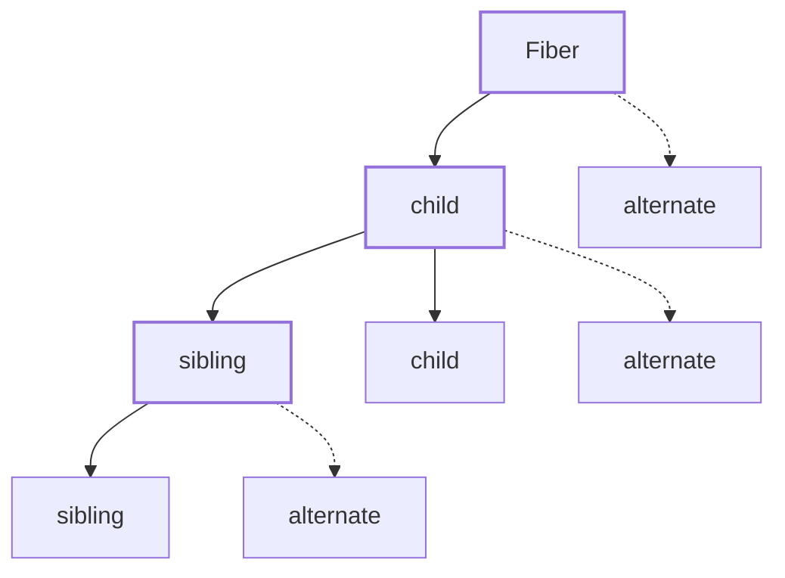

## Concurrent Mode

The first step towards modern React is **concurrent rendering** which means breaking rendering into chunks that could be interrupted.

This is the exact thing which led to the creation of the Fibers.

---

## Fiber as a unit of work

Instead of recursion, we will switch to **explicit units of work**.

Each node in the tree becomes something that can be:

- processed
- paused
- resumed
- abandoned

This single change explains most of React’s modern architecture.

You don’t render _a tree_.  
You process **work units**.

---

## The Fiber Tree Structure



## Rendering with Fibers

In the **render** we’ll create the root fiber and set it as the _nextUnitOfWork_. Additonally, we'll create a _performUnitOfWork_ function that will:

- Add the element to the DOM
- Create the fibers for the element’s children
- Select the next unit of work

The next unit of work is selected based on the following conditions:

- If it has a child → go to child

- Else if it has a sibling → go to sibling

- Else go up to parent until a sibling is found

- If none and root is reached → render is done

This is essentially a depth-first traversal using child → sibling → parent links.

## The Work Loop

Now to put this into action we need a loop that keeps performing work until there’s no more work left.

```javascript
function workLoop(deadline) {
  let shouldYield = false;
  while (nextUnitOfWork && !shouldYield) {
    nextUnitOfWork = performUnitOfWork(nextUnitOfWork);
    shouldYield = deadline.timeRemaining() < 1;
  }
  if (!nextUnitOfWork && wipRoot) {
    commitRoot();
  }
  requestIdleCallback(workLoop);
}
```

## Commitment Issues

Once the render is done, we need to commit the changes to the DOM. However, since the render could be interrupted, we need to ensure that the DOM is only updated when the entire tree is ready.

We will handle this in the next section.
