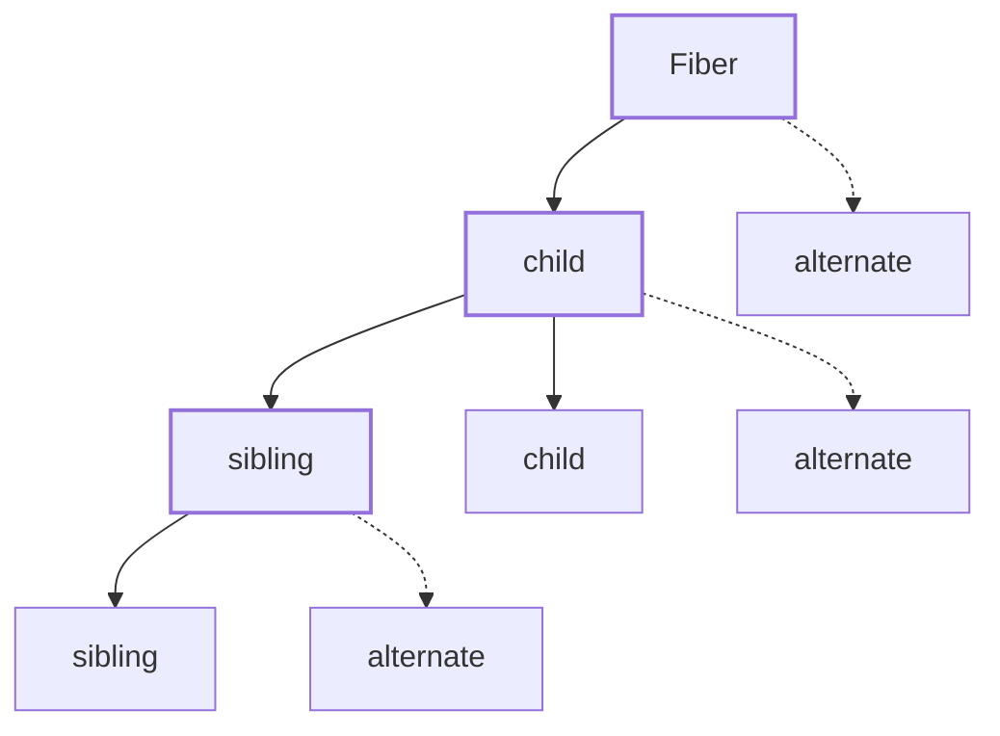
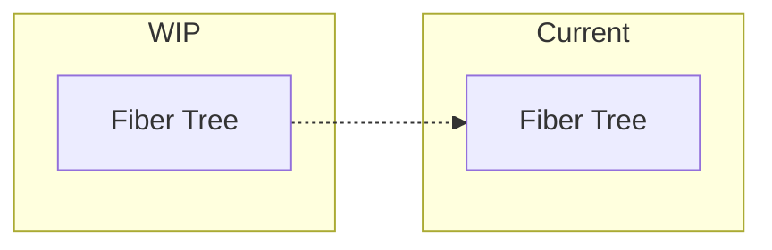

## Understanding State in a Fiber Reconciler

Once rendering became incremental, the next problem was **state**.

If rendering can pause or restart, you can’t mutate the “current” tree directly. You need somewhere safe to build the next version.

That’s where work-in-progress trees come in.

---

## The fiber tree structure

Each fiber represents a single unit of work and is linked using pointers:

- `parent`
- `child`
- `sibling`
- `alternate` (previous render)
- `dom`
- `props`
- `effectTag`
- `hooks`

Traversal happens by walking `child → sibling → parent`, not recursion.

---

## Work-in-progress (WIP) trees

Every update builds a **new tree**.

- The current tree represents what’s `on the screen now`
- The WIP tree represents what `will be on the screen`

Each fiber in the WIP tree points back to its previous version using `alternate`. That pairing makes comparison explicit and cheap.

Nothing touches the DOM while this tree is being built.

  

---

## Why this mattered more than expected

Early versions mutated the current tree directly. That caused:
- impossible-to-reason-about bugs
- half-applied updates
- broken effects

Once WIP trees were enforced, those bugs disappeared.

It became impossible to “half update” the UI.

---

## How to compare?

This was the point where the system stopped feeling fragile.

But the question still is — how do we compare the current and WIP trees?
