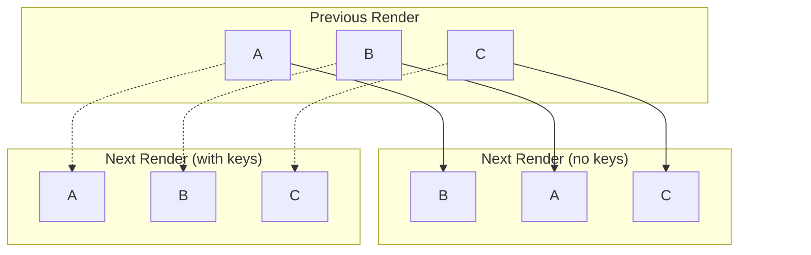

## The Logic Behind Tree Comparison

It is called Reconciliation and this is where most complexity lives.

Rendering just builds trees. Reconciliation decides how trees relate.

---

## What reconciliation actually does

For each new element, the reconciler answers:
- Can this reuse an old fiber?
- Does the type match?
- Is this an update, placement, or deletion?

No DOM mutations happen here. Only decisions.

---

## Keys stopped feeling optional

Without keys, reconciliation is positional.

Reordering lists immediately caused:
- state jumping
- unnecessary deletions
- broken effects

Keys make identity explicit.

  

---

## Hooks and fiber identity

Hooks only work because:
- state is stored on the fiber
- hooks are read in order
- the same component maps to the same fiber

There is no name-based lookup. Just order and identity.

That’s why hooks feel strict — because they are.

---

## Building the Helpers

This was the point where React’s rules stopped feeling arbitrary.

After implementing the reconciliation and hooks yourself, the constraints feel inevitable.
