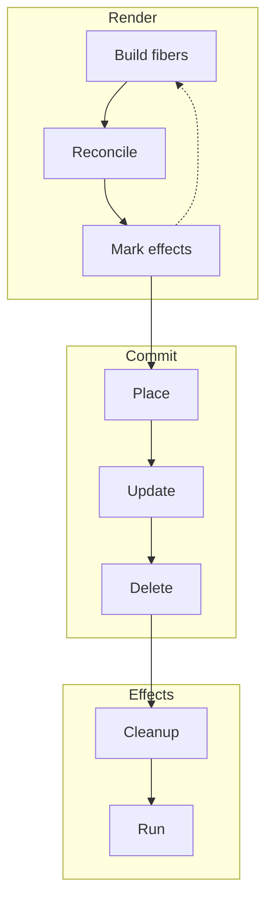

## Building & Undestading Effects

By the time commit runs, all decisions are already made.

That’s intentional.

---

## The commit phase

The commit phase:
- applies placements
- applies updates
- removes deletions
- runs effect cleanups
- runs new effects

It cannot yield. It cannot be interrupted.

  


---

## Effects only make sense after commit

Running effects during render caused:
- inconsistent DOM access
- broken cleanup logic
- unpredictable ordering

Deferring effects until after commit fixed all of it.

---

## How this changed my thinking about UI

This project didn’t make me faster at writing components.

It changed how I think about systems.

I now see:
- rendering as planning
- commits as execution
- hooks as ordered state machines
- keys as identity, not hints

---

## Trying it yourself

I packaged this reconciler as a small framework and published it to npm called [Sense](https://www.npmjs.com/package/@ommishra/sense).

If you want to explore and read through the renderer end-to-end go through the codebase [GitHub](https://github.com/ommgh/sense).

Want to test this renderer and play along with it, you can spin up a minimal app using the provided CLI and read through the renderer end-to-end.

```bash
npx create-sense-app
```

---

## Final thoughts

Frameworks aren’t magic.

They’re carefully constrained systems built around very real limitations. Rebuilding one forces those constraints into the open — and that understanding carries far beyond UI code.
